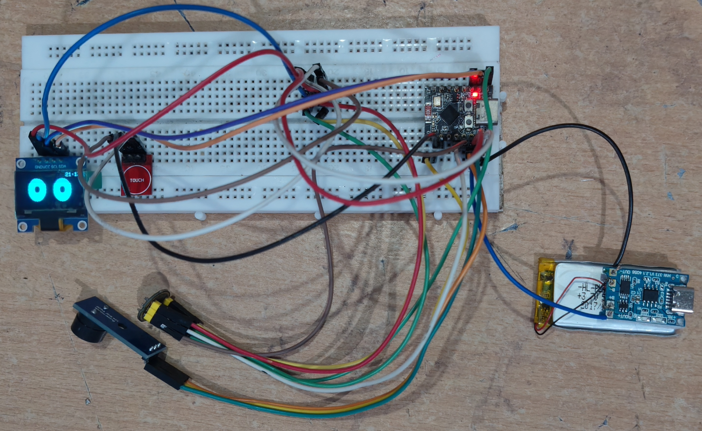

# Smart Desk Assistant 

## Overview

**MARVIN** (*Machine Learning Assisted Reactive Voice-enabled Intelligent Node*) is a compact voice-enabled desk buddy designed for intelligent voice interaction and everyday assistance.

The project combines **Voice Machine Learning, Embedded Systems, Edge AI, IoT, and Mobile Application Development** into a single end-to-end intelligent system.

MARVIN uses a custom voice recognition model trained on **7,000+ audio samples** collected from different speakers and augmented to improve dataset diversity. The trained model recognizes predefined voice commands and enables the device to respond and perform different actions based on the detected command.

A companion mobile application was also developed to control and configure the system, with support for **Primary and Secondary users** and multiple productivity and utility features.

---

## Key Features

* Custom voice recognition model
* 7,000+ training audio samples
* Audio data collection and augmentation
* Voice-based device interaction
* Edge AI inference
* Multi-user functionality
* Primary and Secondary user access
* Mobile application integration
* Weather and Wi-Fi configuration
* Messaging and reminders
* Find My Phone functionality

---

## Voice Recognition System

The voice recognition model was trained using a custom dataset containing **7,000+ audio samples**.

The dataset was created by:

1. Manually collecting voice recordings from different speakers
2. Cleaning and preprocessing the collected audio
3. Applying audio augmentation
4. Increasing dataset diversity
5. Preparing the processed samples for model training
6. Training the custom voice recognition model
7. Deploying the trained model for inference on the embedded system

### Recognized Commands

MARVIN currently recognizes the following commands:

* **"Marvin"**
* **"Hello"**
* **"Greet"**
* **"Clock"**
* **"Forecast"**

Each recognized command can trigger a corresponding response or action.

---

## Voice ML Pipeline

```text
Voice Data Collection
        ↓
Audio Cleaning
        ↓
Audio Preprocessing
        ↓
Data Augmentation
        ↓
Dataset Preparation
        ↓
Model Training
        ↓
Model Evaluation
        ↓
Model Deployment
        ↓
Edge AI Inference
        ↓
Voice Command Recognition
        ↓
MARVIN Response / Action
```

---

## Hardware Components

The MARVIN prototype integrates the following hardware components:

- ESP-32 C3 supermini Microcontroller
- Microphone
- Passive Buzzer
- OLED Display
- Touch Sensor
- Supporting electronic components

### Hardware Setup



---

## Final MARVIN Prototype

All the hardware components were integrated into a compact desk-buddy prototype designed for voice-based interaction and everyday assistance.


---

## Companion Mobile Application

A custom Android application was developed **with the assistance of OpenAI Codex** to control and configure the MARVIN system.

The application supports **Primary and Secondary users** and provides multiple utility and productivity features.

### Application Features

- Drawing Canvas
- Messaging
- Timer
- Study Mode
- Medicine Reminders
- General Reminders
- Wi-Fi Settings
- Weather Settings
- Find My Phone

---

## Multi-User System

MARVIN supports two user levels:

### Primary User

The primary user has access to the main configuration and control features of the system.

### Secondary User

Secondary users can access the features assigned to them without having the same level of control as the primary user.

This provides a basic access-control structure for multi-user interaction.

---

## Technologies Used

### Programming

* Python
* C/C++
* Arduino Framework

### Machine Learning

* Voice / Audio Machine Learning
* Audio Preprocessing
* Data Augmentation
* Custom Voice Recognition Model
* Edge AI

### Embedded Systems

* ESP-based Microcontroller
* Microphone
* Embedded ML Inference
* Device Control

### Mobile Application

- Android
- Custom Mobile Application
- Developed with the assistance of OpenAI Codex

---

## Future Improvements

* Expand the voice command vocabulary
* Improve robustness in noisy environments
* Integrate additional sensors
* Add more autonomous actions
* Improve on-device model optimization
* Expand the mobile application's device-control capabilities

---

